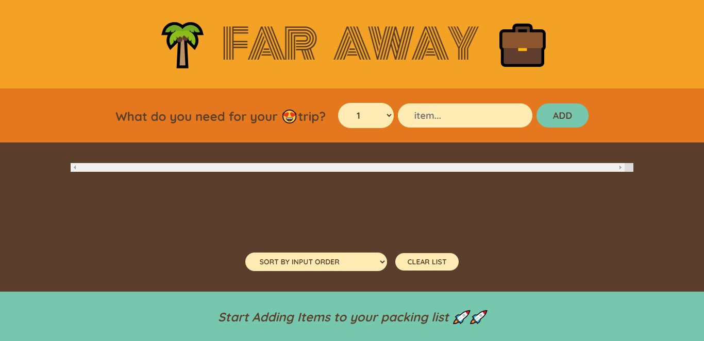

# Description
Far Away is web Application built with React that allows users to add, edit, and delete items. Users can also sort the items by description, input order, or status. Inaddition Users can see the progress of the item they have added and marked as complete.

# Getting Started
To run the application, you will need to have Node.js and NPM installed. Once you have those installed, you can clone the repository and run the following commands:

npm install
npm start

This will start the application on your local machine at http://localhost:3000.

# Image

# Features
The application has the following features:

A form input where users can add items.

A drop down option input where users can select numbers.

The ability to sort items by description, input order, or status.
Usage

User can track down the items that are not packed 

# Usage
To use the application, simply add items to the form input and select a number from the drop down option input. You can then sort the items by description, input order, or status by clicking on the corresponding button.

# Practise Case

1.Creating React Component

2.Rendering List in React

3.Working with Array Immutability in React

4.Working with React Forms, Handlers and Events.

# Contributing
If you would like to contribute to the application, please fork the repository and submit a pull request.

# License
The application is licensed under the MIT License.